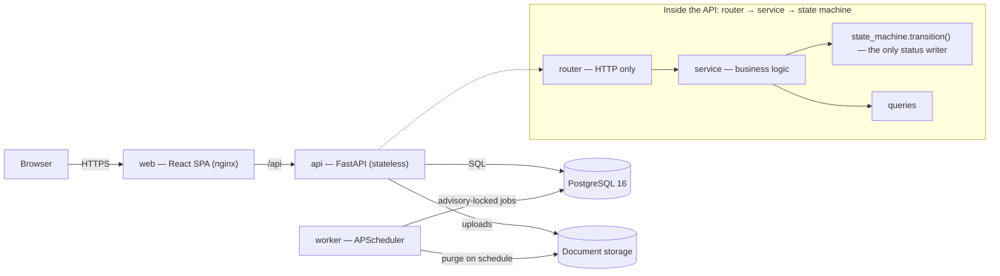

# LoanFlow

[](https://github.com/sujitd7/loanflow/actions/workflows/ci.yml)
&nbsp;·&nbsp; FastAPI · React + TypeScript · PostgreSQL · Docker · GitHub Actions

A **maker–checker loan-underwriting workbench**. Operations logs an incoming loan
file; Underwriting runs four independent maker–checker verifications (credit, KYC,
payment eligibility, tax return); once all four pass the file is marked
**fund-ready-to-release**; a housekeeping job purges it 30 days later, leaving only
a PII-free audit summary.

I'm building it in the open to practise **React + TypeScript** and
**FastAPI + PostgreSQL** end to end — with the patterns a real system-of-record
needs (RBAC, an explicit state machine, optimistic locking, an append-only audit
trail, expand/contract migrations) rather than CRUD — and to run a deliberate,
**guard-railed [Claude Code](docs/ai-workflow.md) workflow** on top of it.

> **Status:** early. Backend foundation (identity + RBAC) is done and CI-green;
> the loan-file domain and the React UI are next. See
> [Roadmap progress](#roadmap-progress).

Full plan: [`docs/ROADMAP.md`](docs/ROADMAP.md) ·
Architecture: [`docs/ARCHITECTURE.md`](docs/ARCHITECTURE.md) ·
State machine: [`docs/STATE_MACHINE.md`](docs/STATE_MACHINE.md) ·
ADRs: [`docs/adr/`](docs/adr/)

---

## Architecture

Four small services, one system of record. The `api`, `web`, and `worker` images
are identical in dev and prod; only the Postgres and object storage differ.



**Backend layering** (`api/app/`)

| Layer        | Responsibility |
|--------------|----------------|
| `routers/`   | HTTP only — validate input, call one service, serialize a schema. RBAC declared here via `require_roles(...)`. |
| `schemas/`   | Pydantic v2 request/response models — no raw dicts cross the boundary. |
| `services/`  | Business logic. Every status change goes through `state_machine.transition()`; a hook flags raw `.status =` writes. |
| `models/`    | SQLAlchemy 2.0 ORM (`Mapped[...]`), Alembic migrations. |
| `db.py`      | Engine + `get_db` — one session per request, commit on success / rollback on error. |
| `deps.py`    | Auth + RBAC dependencies. |

**Domain rules worth a look**

- **State machine** — loan files move `DRAFT → SUBMITTED → IN_REVIEW →
  FUND_READY_TO_RELEASE → PURGED`; review tasks have a
  `PENDING_MAKER ⇄ PENDING_CHECKER → COMPLETED` cycle with a rejection loop. One
  function owns every transition; a hook blocks raw `.status =` writes.
- **Maker ≠ checker** — a reviewer can never approve their own task
  (DB check constraint + service guard).
- **Optimistic locking** — task writes carry a `version`; a stale write is a
  `409`, the client refetches and retries.
- **Audit** — every transition appends one immutable `task_events` row.
- **Housekeeping** — the purge job is idempotent and wrapped in
  `pg_try_advisory_lock` so replicas never double-run it.
- **Migrations** are expand/contract, so a code rollback never needs a DB rollback.

**RBAC matrix**

| Role         | Team | Can |
|--------------|------|-----|
| `OPS_MAKER`  | OPS  | create / submit loan files, upload documents |
| `OPS_CHECKER`| OPS  | review the intake step |
| `UW_MAKER`   | UW   | perform a review task (maker side) |
| `UW_CHECKER` | UW   | approve / reject a review task (checker side) |
| `ADMIN`      | —    | reassign tasks, trigger housekeeping, read everything |

---

## Roadmap progress

One phase per PR, tests green before the next. Full detail in
[`docs/ROADMAP.md`](docs/ROADMAP.md); current state in
[`docs/STATUS.md`](docs/STATUS.md).

| Phase | Scope | State |
|-------|-------|-------|
| **P0** | Monorepo, `docker-compose`, `/health` API + Vite app, worker skeleton, CI, `.claude/` workflow config | ✅ done |
| **P1** | Identity: `users` + `refresh_tokens`, Argon2, JWT login / rotating refresh / logout / me, `Role` enum + `require_roles(...)`, 35 tests | ✅ done · [PR #1](https://github.com/sujitd7/loanflow/pull/1), CI green |
| **P2** | Loan-file intake + atomic 4-task generation, document upload, list/detail with no N+1 | ▶ next |
| **P3** | Maker–checker flow, `state_machine.transition()`, `version` conflicts, audit events | ☐ |
| **P4** | Completion + housekeeping purge job (`freezegun` tests, advisory lock) | ☐ |
| **P5** | React foundation + core flows — auth context, Axios refresh interceptor, TanStack Query, submission wizard, My Tasks, review drawer, MSW tests | ☐ |
| **P6** | Dashboards — aggregation endpoints, Recharts funnel / aging / per-member | ☐ |
| **P7** | Hardening — Playwright E2E, rate limiting, JSON logging, deterministic seed data, `/security-review` | ☐ |
| **P8** | Deploy — multi-stage Dockerfiles, GHCR, release migrations, smoke test, rollback | ☐ |
| **P9** | Showcase — hero GIF, live demo, architecture write-up, Loom | ☐ |

**Highlight from P1:** the `security-reviewer` subagent caught a real HIGH-severity
bug before merge — refresh-token reuse-detection was writing the revocation into
the request-scoped session, which then got rolled back by the 401 it raised, so
in production a stolen refresh token was effectively unrevocable. Fixed by
committing that side effect in its own unit of work, with a regression test using
real per-request sessions. (Details in [PR #1](https://github.com/sujitd7/loanflow/pull/1).)

---

## Built with a guard-railed Claude Code workflow

This repo is also a worked example of **AI-assisted development with real
guard-rails** — not "pasted from a chatbot". Everything below is committed under
[`.claude/`](.claude/) and [`scripts/hooks/`](scripts/hooks/); the full write-up
is [`docs/ai-workflow.md`](docs/ai-workflow.md).

- **`CLAUDE.md`** — a project brief (stack, conventions, the "never write
  `.status` directly" rule, the RBAC matrix) loaded into every session, so the
  assistant works to *this* codebase's standards.
- **Hooks** — deterministic checks the harness runs, not the model:
  auto-format/lint on every write, **block dangerous shell commands**
  (`rm -rf`, unforced force-push, prod `psql`, `fly deploy`), flag raw status
  writes, and optionally run the test suite on stop so a task can't "finish" red.
- **Subagents** (`.claude/agents/`) — seven focused roles used per feature:
  `api-designer`, `db-migrator`, `workflow-modeler`, `security-reviewer`,
  `frontend-builder`, `test-writer`, `pr-writer`.
- **Skills** (`.claude/skills/`) — repo-specific recipes: `add-endpoint`,
  `add-migration`, `add-scheduled-job`, `add-page`, `seed-demo-data`, `deploy`.
- **Roadmap-driven loop** — `/loop` works `docs/ROADMAP.md` one checkbox at a
  time: write the tests first, make them pass, run the suite, tick the box,
  commit.

**Delegated:** boilerplate routers/schemas/fixtures/migrations, test scaffolding,
formatting, PR text. **Kept by me:** the domain model and state machine, the RBAC
design, architectural calls (ADRs), migration discipline, and every review
decision.

---

## Run it locally

With Docker:

```bash
cp .env.example .env
docker compose up --build
```

**No working Docker?** See [`docs/LOCAL_DEV.md`](docs/LOCAL_DEV.md) — the stack
runs natively with a Python venv + `npm run dev` against any Postgres (a free
Neon database works). The backend test suite falls back to in-memory SQLite with
zero setup.

| Service       | URL                          |
|---------------|------------------------------|
| Web (Vite)    | http://localhost:5173        |
| API (FastAPI) | http://localhost:8000        |
| API docs      | http://localhost:8000/docs   |
| API health    | http://localhost:8000/health |
| Postgres      | localhost:5432               |

## Development

```bash
make help                      # list tasks
make up  /  make down
make test                      # api (pytest) + web (vitest)
make fmt  /  make lint
make migrate m="add loan_files"
```

## Repo layout

```
CLAUDE.md   project brief loaded into every Claude Code session
api/        FastAPI service + SQLAlchemy models + Alembic migrations + pytest
worker/     APScheduler job runner (housekeeping / purge)
web/        React + TypeScript SPA (Vite)  — foundation lands in P5
infra/      deployment config             — added in P8
docs/       roadmap, architecture, state machine, ADRs, AI-workflow write-up
.claude/    committed Claude Code config: hooks, subagents, skills
scripts/    hook scripts and helpers
```

## Tech stack

| Layer     | Choice |
|-----------|--------|
| Frontend  | React 18, TypeScript, Vite, TanStack Query, react-hook-form + zod |
| Backend   | FastAPI, SQLAlchemy 2.0, Alembic, Pydantic v2, psycopg 3, Argon2 + JWT |
| Database  | PostgreSQL 16 |
| Jobs      | APScheduler in a dedicated worker process ([ADR 0002](docs/adr/0002-apscheduler-over-celery.md)) |
| Deploy    | Docker images → Fly.io / single VPS (planned, P8) |
| CI/CD     | GitHub Actions → GHCR |
